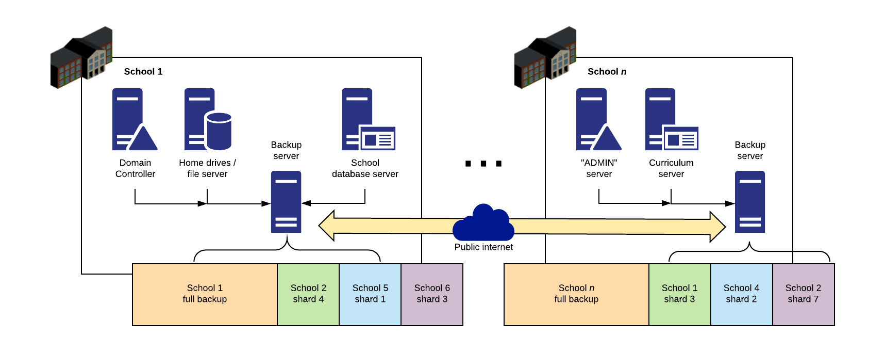
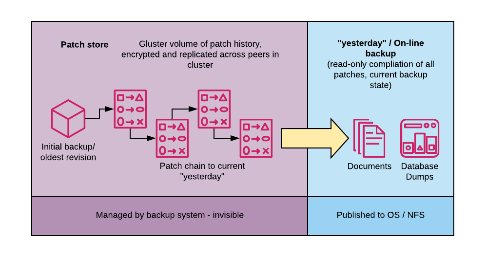

CoStor was my dissertation honours project as part of my Computer Science degree course at the University of Edinburgh.

The concept behind the application was to allow a small number of organisations (in the initial usecase, a confederation
of schools) to pool storage on commodity systems to build a fault-tolerant, geo-distributed backup solution by distributing backup data across appliances located inside different organisation datacenters. Backups were to be 
file-level and make use of delta syncs, and the system was designed to be resilient and able to operate over 
conventional, low-grade WAN links using HTTPS to simplify deployment. Each site was designed to be able to be 
recovered from shards replicated across the peer sites in the event of a catestrophic failure
and all data was to be encrypted at rest.

The "core" database was based around (another) Django web application, which managed replication and version history, with
platform and application specific "agents" pushing data to the core.

Initially, the plan was to use Gluster.fs as the storage backend, however on further investigation, it proved easier to 
implement this using the Django file object wrapper and manage the "index" of data in PostgreSQL.

Performance of this structure probably wasn't entirely ideal, however it was a very good introduction into handling the 
quirks that you may find in a Linux filesystem and ensuring that all metadata was correctly captured. The tree structure 
which was used for deduplicating the file tree on a per-file and per-folder basis was also more challenging to implement 
in a sensible and robust way.
